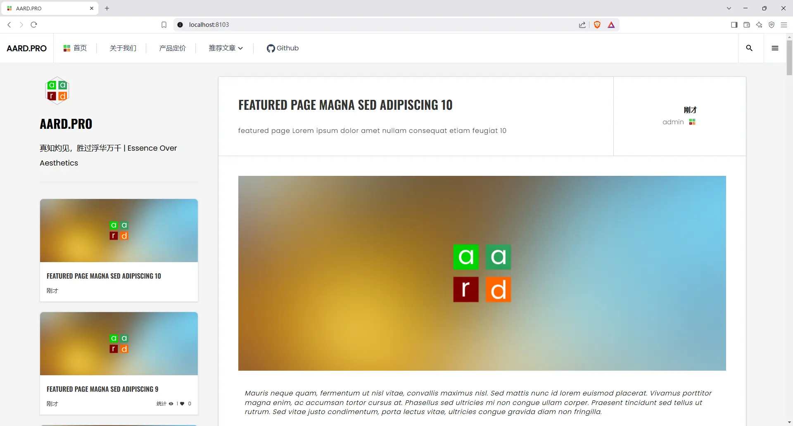
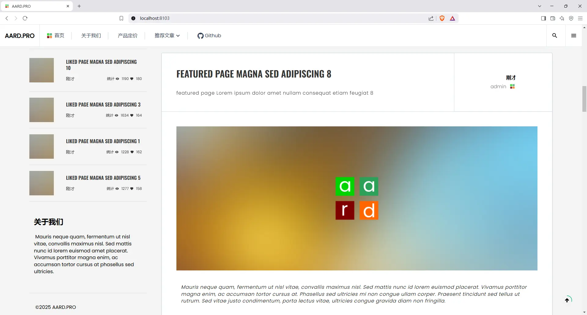
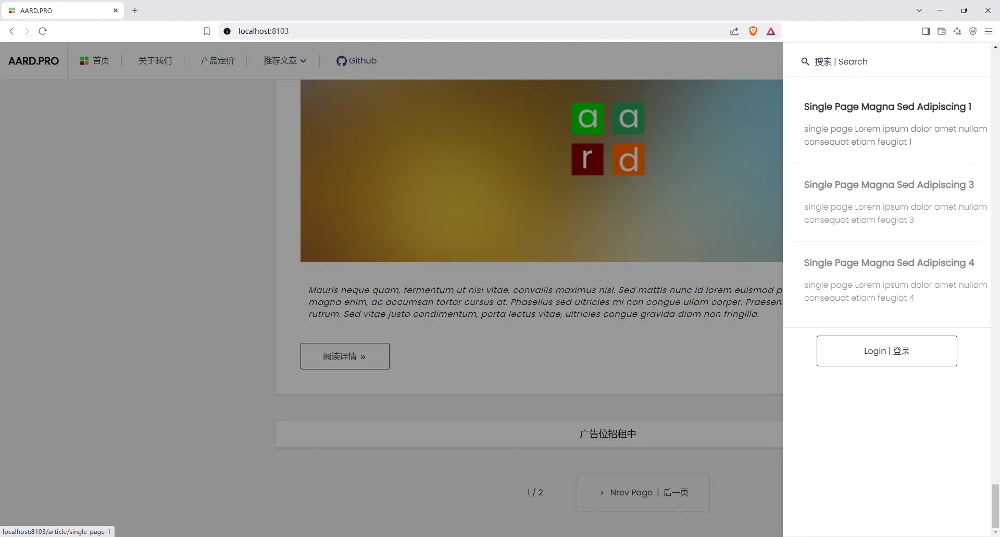
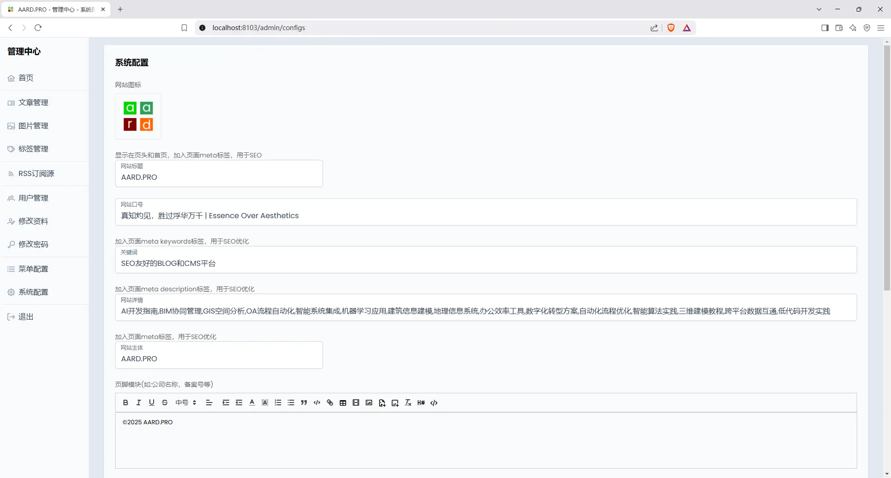
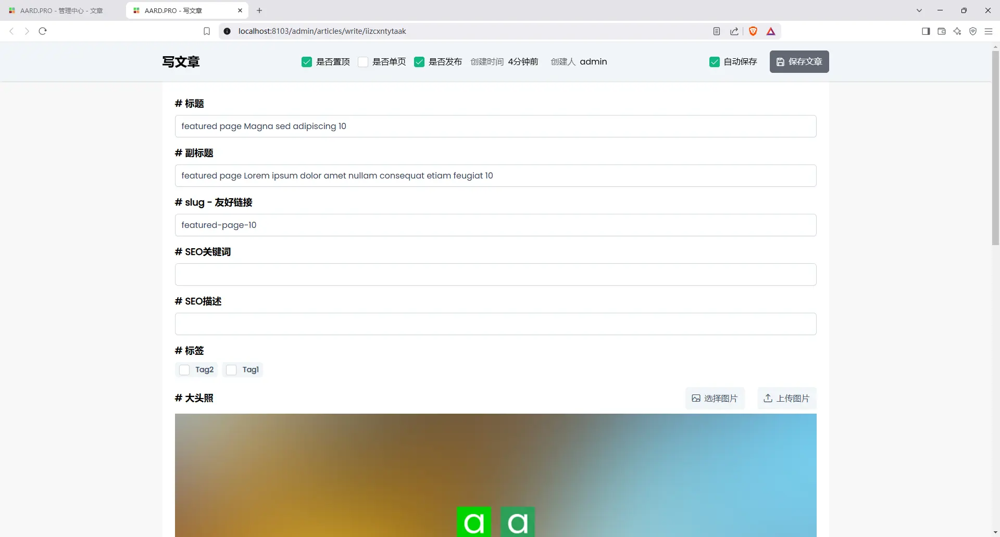
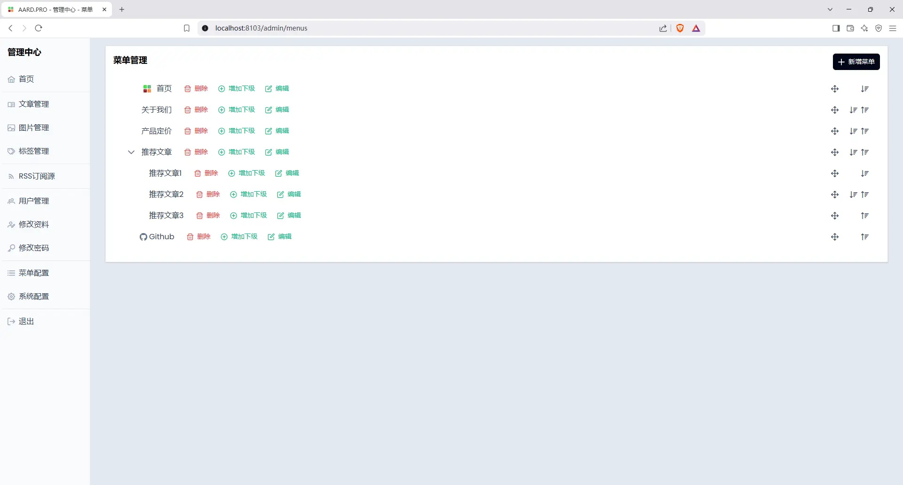

# astro-cms
> A SEO-friendly, Astro-based responsive blog/CMS system with optimized content management.    
> 一个基于 Astro 开发的 SEO 友好、响应式博客/内容管理系统。    

## 部署
***注意拉取docker需要魔法上网***
```bash
git clone https://github.com/aardpro/astro-cms.git
cd astro-cms
docker compose up -d
# 然后通过 http://127.0.0.1:3000访问
# 管理员账号：admin
# 管理员初始密码：admin
```
## 源码
***目前部分组件和工具函数仍然使用javascript，未来改为typescript后会开源***
****

## 预览
***首页***

***首页***

***登录入口***

***系统配置***

***管理文章***

***编辑文章***

***编辑菜单***

***裁剪图片***
